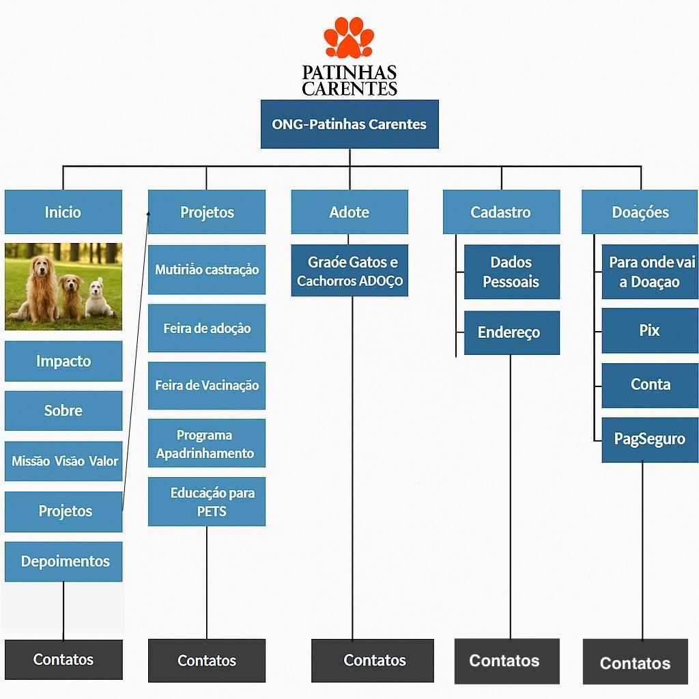

<div align="center>
<h1 >🐾 ONG Patinhas Carentes</h1>

  

 


Este é o repositório oficial da plataforma web da **ONG Patinhas Carentes**, uma organização sem fins lucrativos situada na cidade de São Paulo, dedicada a resgatar, reabilitar e encontrar lares amorosos para cães e gatos em situação de rua.

---
* [🚀 Tecnologias Utilizadas](#-tecnologias-utilizadas)
* [🔧 Como Instalar e Executar](#-como-instalar-e-executar)
* [📄 Licença](#-licença)
  
---

## 📖 Sobre o Projeto

### Missão
Resgatar cães e gatos em situação de abandono e maus-tratos na cidade de São Paulo, oferecer cuidados veterinários, abrigo temporário e promover a adoção responsável, garantindo um final feliz e seguro para cada animal.

### Visão
Ser uma organização referência no combate ao abandono de animais em nossa cidade, contribuindo para uma comunidade mais consciente, onde todos os animais de estimação sejam respeitados, cuidados e tenham um lar amoroso.

### Valores
* **❤️ Respeito à Vida:** Toda vida animal é valiosa e merece ser protegida
 Agir sempre com empatia e carinho em relação aos animais e às pessoas.
* **🛡️ Responsabilidade:** Comprometer-se com a saúde e o bem-estar de cada animal resgatado, desde o acolhimento até a adoção.
* **👥 Comunidade:** Trabalhar em conjunto com a população local, voluntários e parceiros para criar uma rede de apoio forte.
* **🔎 Transparência:** Prestar contas de todas as doações recebidas e dos resultados alcançados.

---

## ✨ Funcionalidades

A plataforma contará com as seguintes funcionalidades:

* **🐕 Galeria de Animais:** Uma vitrine com perfis detalhados de cada animal disponível para adoção, com filtros por espécie, porte e idade.
* **📝 Adoção Online:** Formulário de candidatura para adotantes, facilitando o processo inicial de triagem.
* **💳 Doações:** Sistema integrado para doações pontuais e recorrentes (apadrinhamento) via PagSeguro, Mercado Pago, etc.
* **🙋‍♂️ Cadastro de Voluntários:** Área para pessoas que desejam ajudar com lar temporário, transporte ou em eventos.

---
## Estrutura e WireFrame

<div style="text-align: center">
  
</div>


## 🚀 Tecnologias Utilizadas
<div style="text-align: center" >
    
    
    
</div>
<br>
<br>
<div style="flex">
Este projeto foi construído utilizando tecnologias modernas para garantir uma experiência rápida, segura e agradável para os usuários.
</div>
<br>

| **`HTML5/CSS3/JS`** |
| **`Netlify`** |

---
### Pública: https://ricardovsantos.github.io/Projeto-Site-ONG

---
## 🔧 Como Instalar e Executar

Siga os passos abaixo para configurar e executar o projeto em seu ambiente local.

**opção de instalação:**
* **Git**

```bash
# 1. Clone o repositório
git clone [https://github.com/seu-usuario/ong-patinhas-carentes.git]


